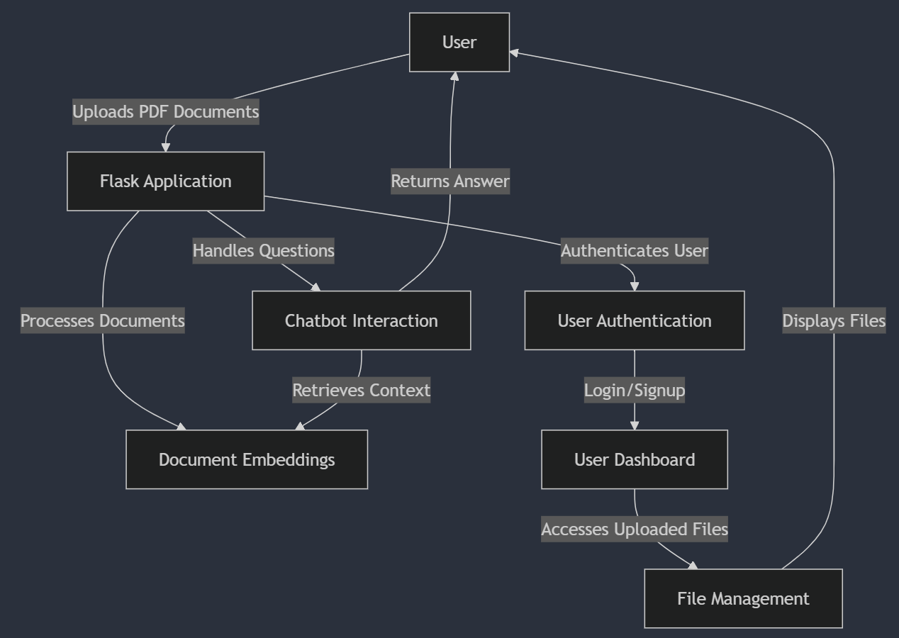

# RAG Document Chatbot

Welcome to the **RAG Document Chatbot**! This application allows users to upload PDF documents and interact with them through a chatbot interface using advanced language models and vector embeddings. Must use 4 PDFs at least, during a session.

## Key Features
- **User Authentication**: Signup, login, and logout functionality with password hashing and session management.
- **Document Upload**: Users can upload multiple PDF documents for interaction.
- **Chatbot Interaction**: Ask questions related to the uploaded documents, receiving context-based answers.
- **Responsive UI**: A user-friendly interface with a sidebar for displaying uploaded files.

## Technologies Used
- **Flask**: A lightweight WSGI web application framework in Python.
- **SQLAlchemy**: SQL toolkit and Object-Relational Mapping (ORM) for Python.
- **Flask-Migrate**: Extension that handles SQLAlchemy database migrations via Alembic.
- **Langchain**: For building the question-answering system.
- **FAISS**: For efficient vector-based document retrieval.
- **Matcha CSS**: A Drop-in semantic styling library in pure CSS. [Learn more about Matcha CSS here](https://matcha.mizu.sh/).

## Routes
| Route                | Description                                       |
|----------------------|---------------------------------------------------|
| `/`                  | Home page                                        |
| `/signup`            | Sign up for a new account                         |
| `/login`             | Log into an existing account                      |
| `/logout`            | Log out of the current session                    |
| `/protected`         | A protected page accessible after login           |
| `/upload`            | Upload PDF documents                              |
| `/ask_question`      | Interact with the chatbot by asking questions     |

## Application Workflow Diagram

The following diagram illustrates the workflow of the RAG Document Chatbot application:




## Running Instructions
To run this application locally, follow these steps:

1. **Clone the Repository**
   ```bash
   git clone <repository_url>
   cd RAG_Project
   ```

2. **Create and Activate a Virtual Environment**
   ```bash
   python -m venv .venv
   source .venv/bin/activate  # On Windows, use .venv\Scripts\activate
   ```

3. **Install Dependencies**
   ```bash
   pip install -r requirements.txt
   ```

4. **Set Up the Database**
   Initialize, migrate, and upgrade the database:
   ```bash
   flask db init
   flask db migrate
   flask db upgrade
   ```

5. **Run the Application**
   ```bash
   python run.py
   ```

## Database Migrations
Any time you make changes to the models, ensure you follow these steps to migrate and apply changes to the database:
```bash
flask db migrate
flask db upgrade
```

## Demo

[! Watch the DEMO](./assets/RAG-Chatbot-Demo.webm)

## Contributing
If you find this application useful, feel free to contribute or give it a ⭐ on GitHub!


